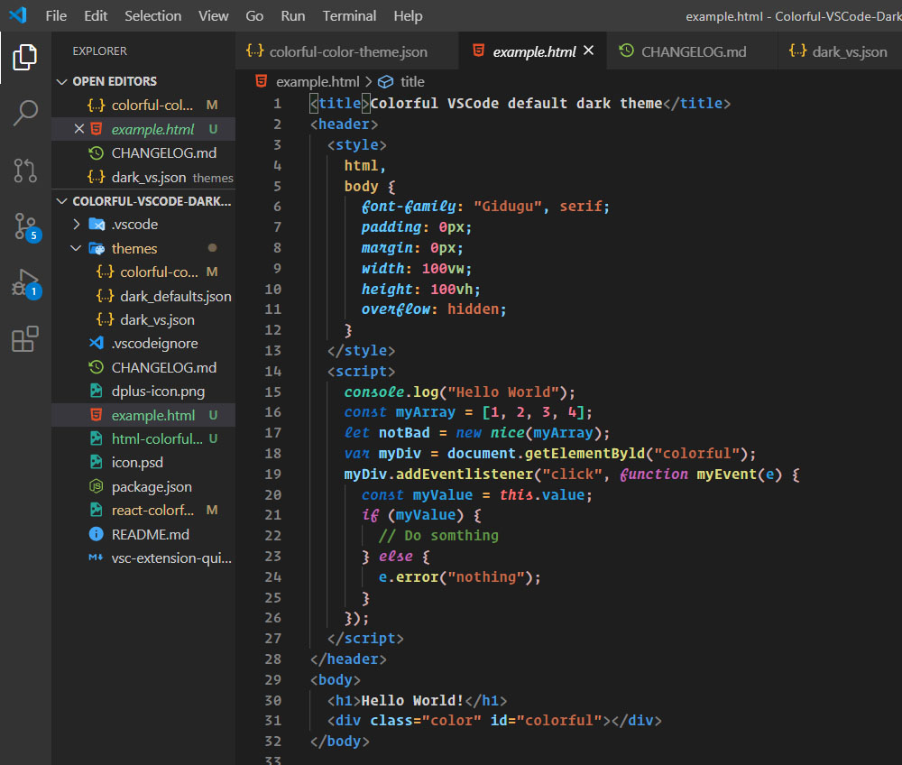
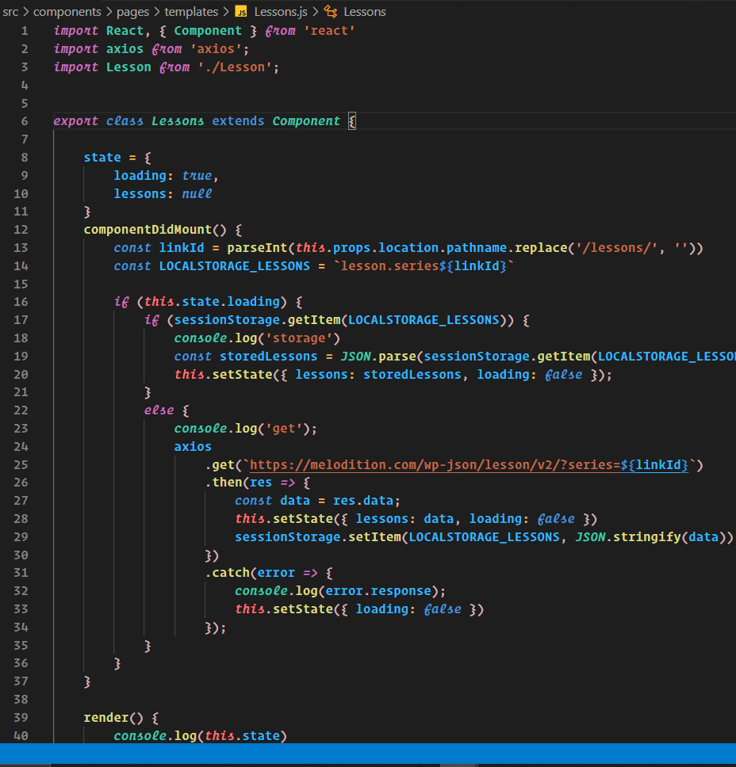

# Colorful DarkPlus

A Visual Studio Code theme for the who in love with dark plus default theme but a bit color changes and some italic font customization. ✨

Used font on demo: Operator Mono.
Used icon on demo: Material Icon Theme.

## Colorful Dark

## HTML

## React

1.  Install [Visual Studio Code](https://code.visualstudio.com/)
2.  Launch Visual Studio Code
3.  Choose **Extensions** from menu
4.  Search for `colorful darkplus`
5.  Click **Install** to install it
6.  Click **Reload** to reload the Code
7.  From the menu bar click: Code > Preferences > Color Theme > **Colorful Dark+**
