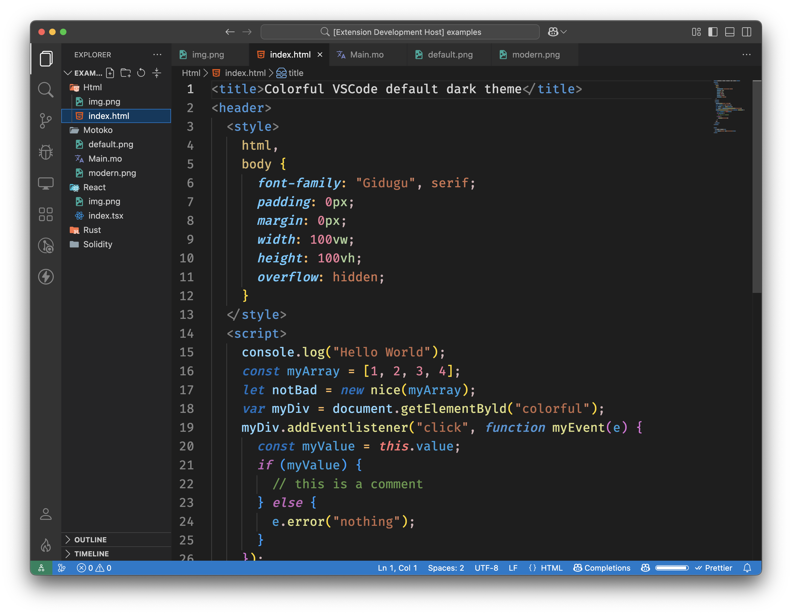
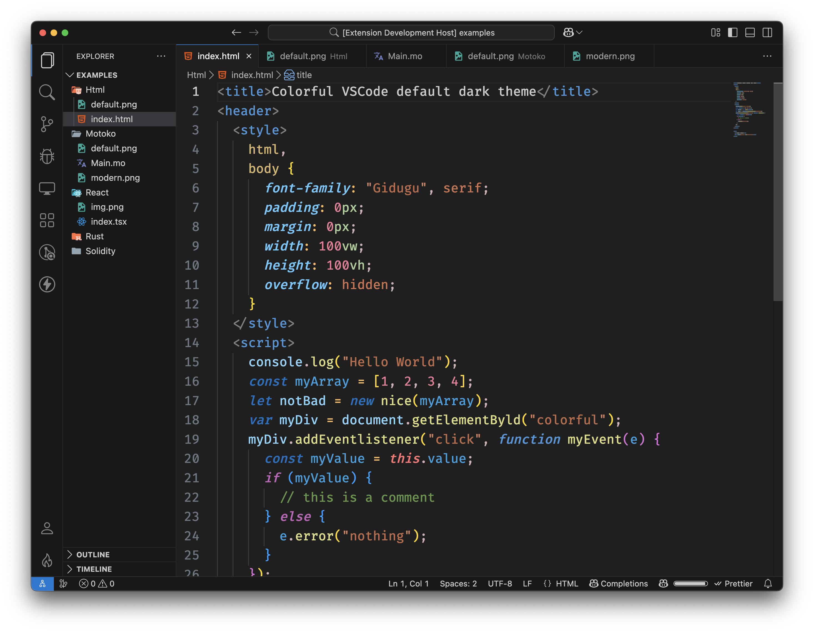
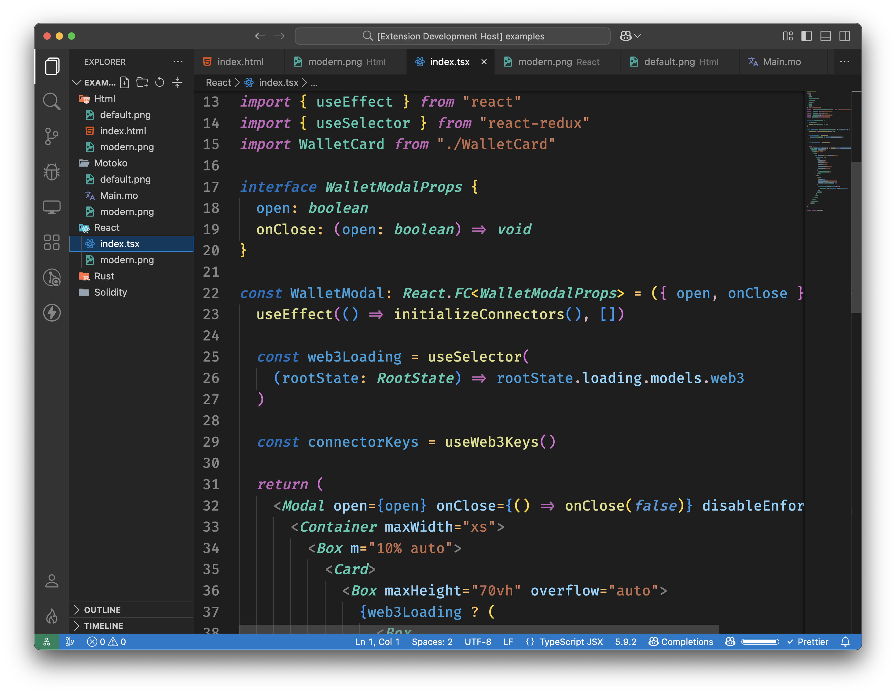
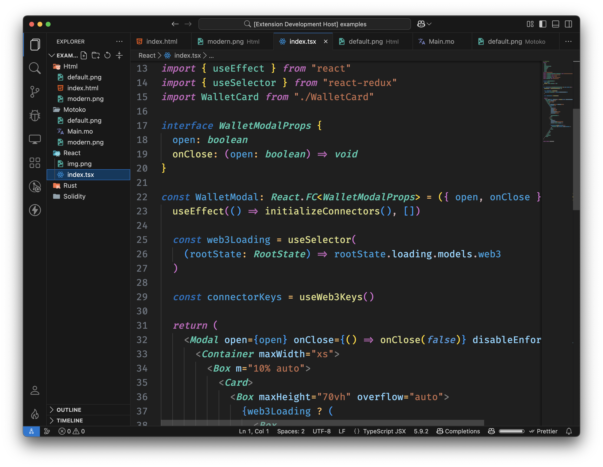
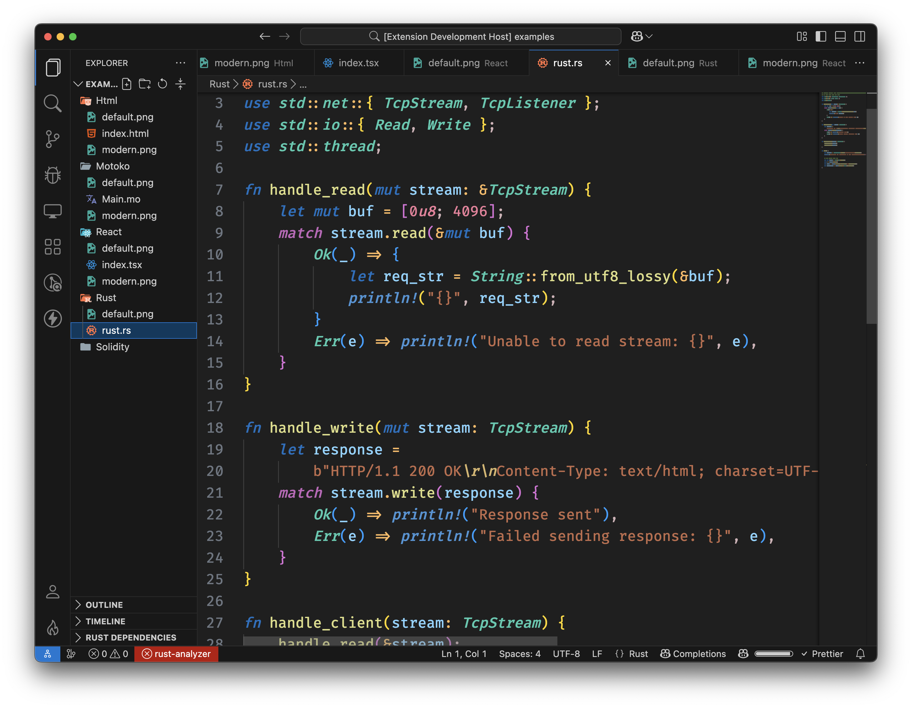
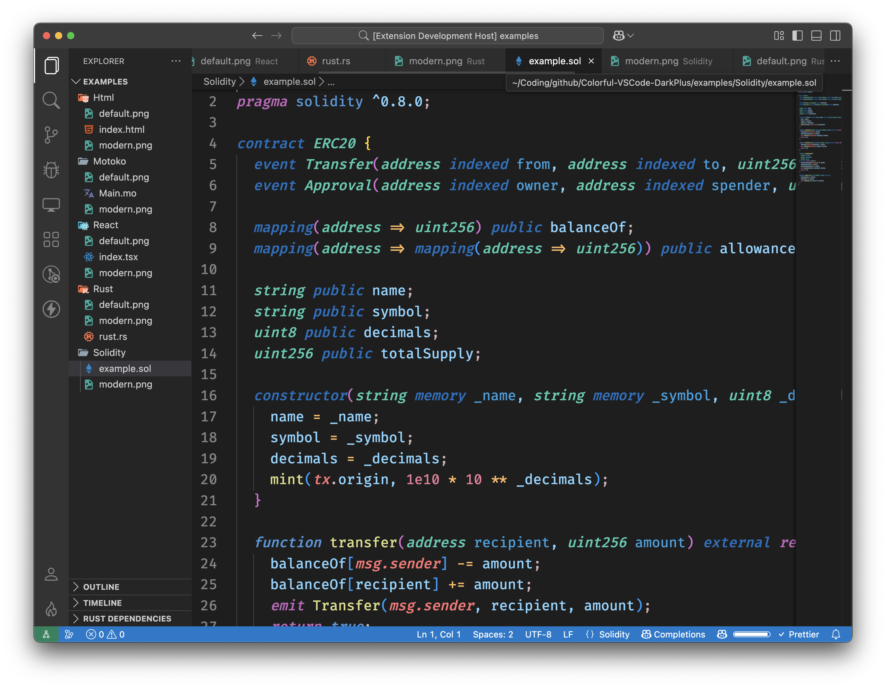
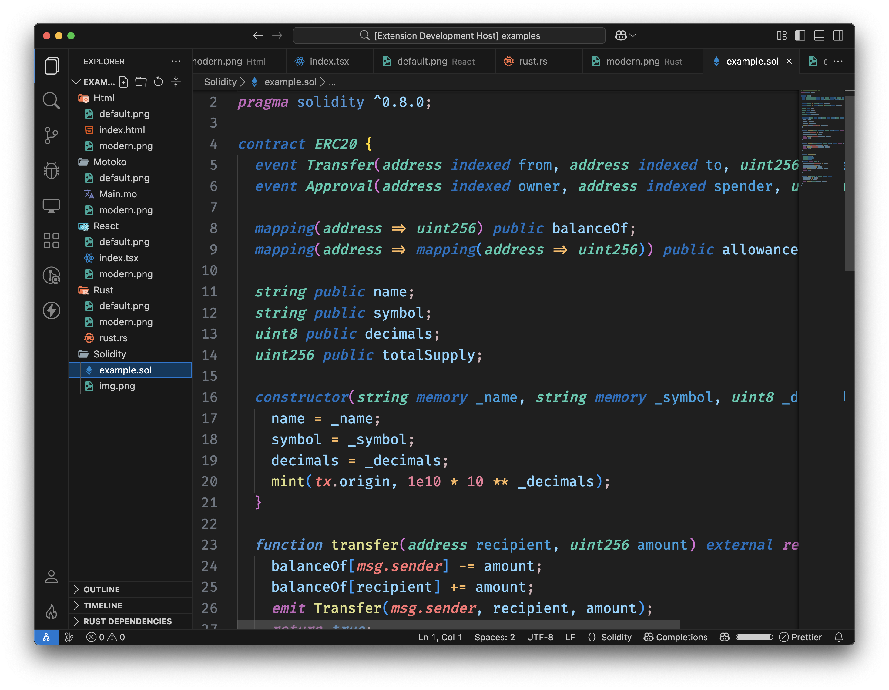
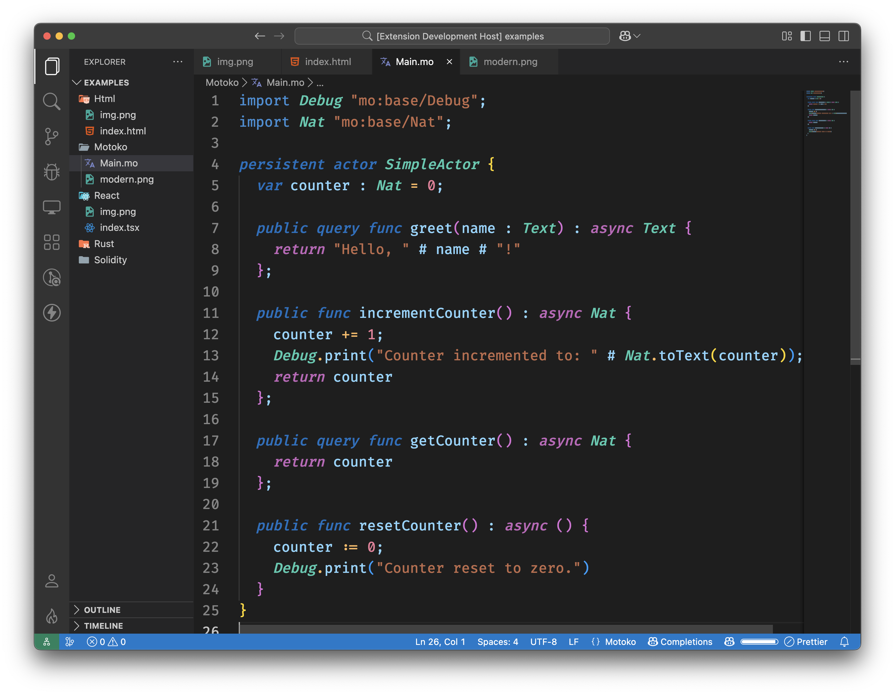
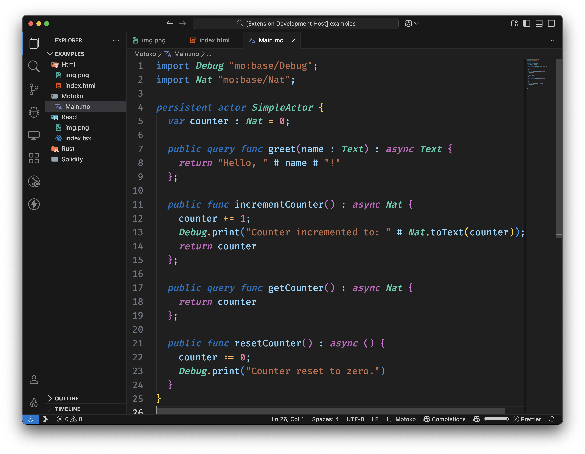

# Colorful DarkPlus

Colorful DarkPlus is a Visual Studio Code theme extension based on the Dark+ default theme with brighter, more colorful accents. It now ships in two variants so you can choose the main UI color style while keeping the same tokenColors:

- Colorful Dark+ (classic vibrant accents)
- Colorful Dark+ Modern — modern UI palette while preserving the same code token colors

Maximum compatibility with:

- [Rust Analyzer](https://marketplace.visualstudio.com/items?itemName=rust-lang.rust-analyzer) + transparent InlayHints
- [Solidity](https://marketplace.visualstudio.com/items?itemName=JuanBlanco.solidity)
- [Motoko](https://marketplace.visualstudio.com/items?itemName=dfinity-foundation.vscode-motoko)

## Screenshots

Each language shows both the Default and Modern variants.

### HTML

Default:

Modern:

Example source: `examples/Html/index.html`

### React (TSX)

Default:

Modern:

Example source: `examples/React/index.tsx`

### Rust

Default:

Modern:

Example source: `examples/Rust/rust.rs`

### Solidity

Default:

Modern:

Example source: `examples/Solidity/example.sol`

### Motoko

Default:

Modern:

Example source: `examples/Motoko/Main.mo`

### C#

Default:

Modern:

Example source: `examples/C#/example.cs`

## Installation

1. Open the Extensions sidebar in Visual Studio Code (Cmd+Shift+X).
2. Search for `Colorful DarkPlus` and click **Install**.
3. Select a theme: go to **Code > Preferences > Color Theme** and pick one of:
   - Colorful Dark+
   - Colorful Dark+ Modern

## Notes for Tweakers

Both variants reuse the same token colors under the hood. If you want to create your own accent variant, add a new theme file that includes `./themes/dark_plus.json` and override only the `colors` section.

## Issues and Contributions

If you encounter any issues or have suggestions, please open an issue or PR on the [GitHub repository](https://github.com/b3hr4d/Colorful-VSCode-DarkPlus).

## Credits

Created with ❤️ by B3HR4D. Based on Visual Studio Code’s Dark+.

## License

This theme is licensed under the [MIT License](https://opensource.org/licenses/MIT).
