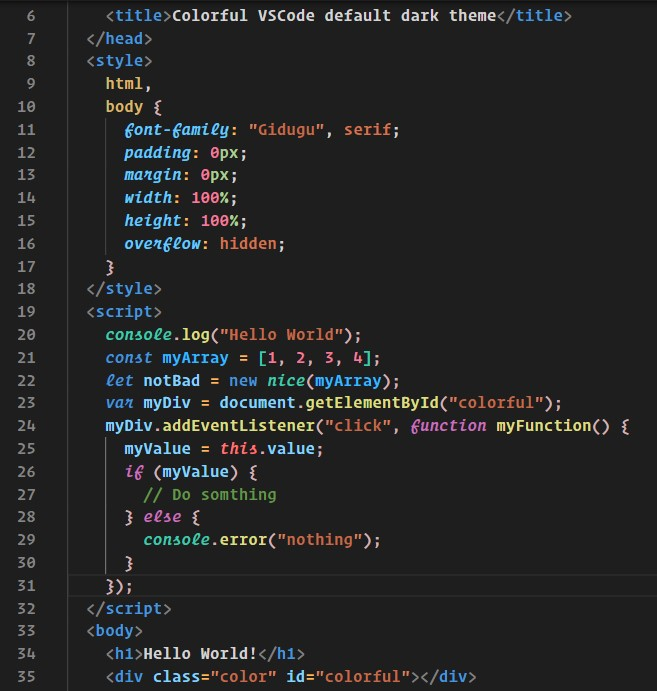

# Colorful DarkPlus

A Visual Studio Code theme for the who in love with dark plus default them but a bit color and some italic font customization. ✨

About this theme, and some of the considerations made while creating it (as well as _how_ to create it should you want to make your own): [https://css-tricks.com/creating-a-vs-code-theme/](https://css-tricks.com/creating-a-vs-code-theme/)

## Colorful Dark

1.  Install [Visual Studio Code](https://code.visualstudio.com/)
2.  Launch Visual Studio Code
3.  Choose **Extensions** from menu
4.  Search for `colorful darkplus`
5.  Click **Install** to install it
6.  Click **Reload** to reload the Code
7.  From the menu bar click: Code > Preferences > Color Theme > **Colorful DarkPlusl**
