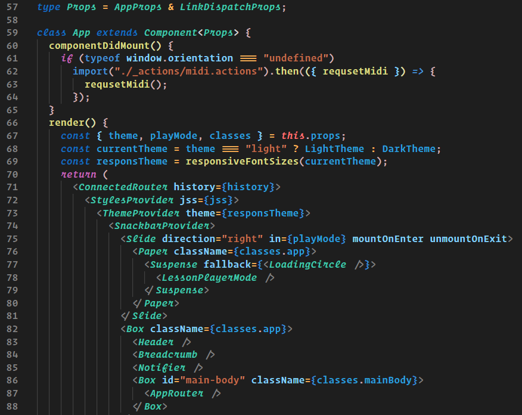
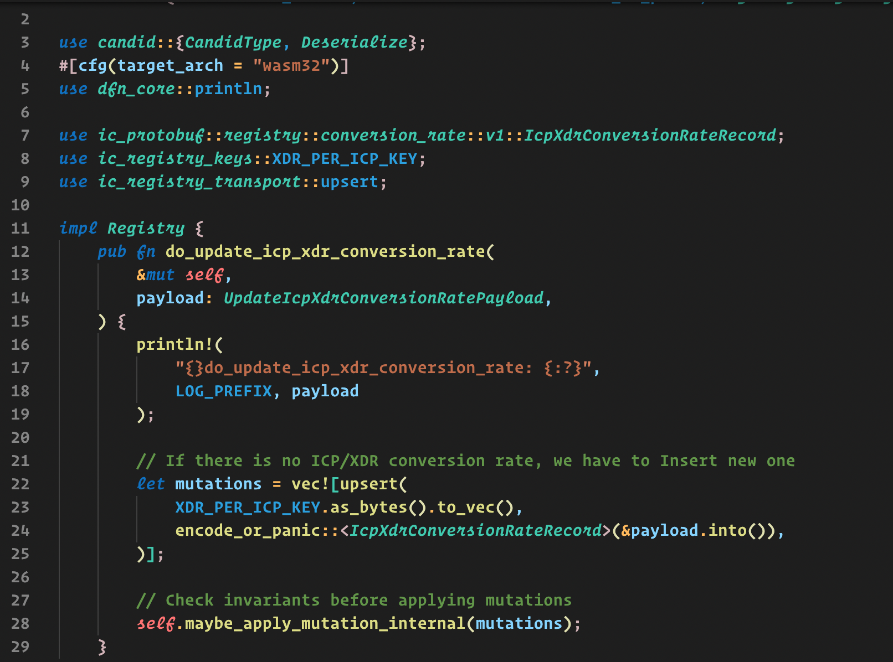
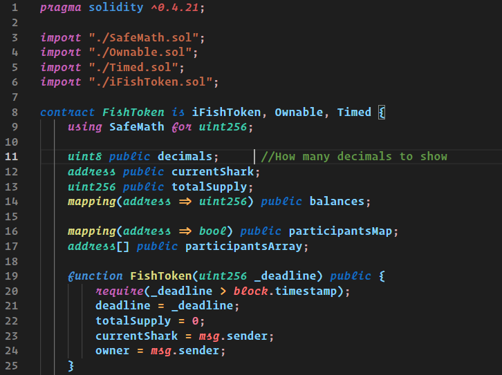
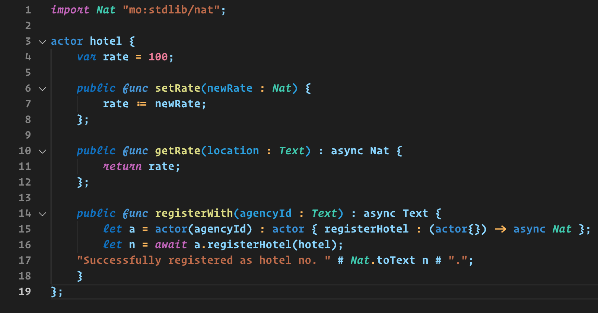

# Colorful DarkPlus

A Visual Studio Code theme for the who in love with dark plus default theme with color changes and some italic font customization. ✨

Full support all vscode languages plus:

- [Rust Analyzer](https://marketplace.visualstudio.com/items?itemName=rust-lang.rust-analyzer) + transparent InlayHints
- [Solidity](https://marketplace.visualstudio.com/items?itemName=JuanBlanco.solidity)
- [Motoko](https://marketplace.visualstudio.com/items?itemName=dfinity-foundation.vscode-motoko)

Used font on demo: Operator Mono.

Used icon on demo: Material Icon Theme.

## HTML

## React

## React Typescript

## Rust

## Solidity

## Motoko

1.  Install [Visual Studio Code](https://code.visualstudio.com/)
2.  Launch Visual Studio Code
3.  Choose **Extensions** from menu
4.  Search for `colorful darkplus`
5.  Click **Install** to install it
6.  Click **Reload** to reload the Code
7.  From the menu bar click: Code > Preferences > Color Theme > **Colorful Dark+**
